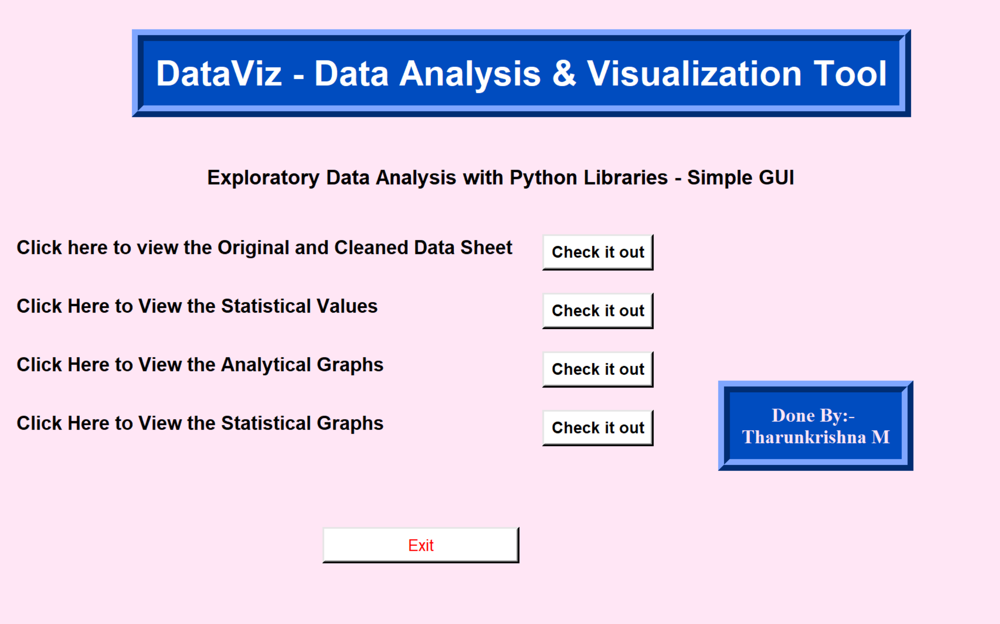
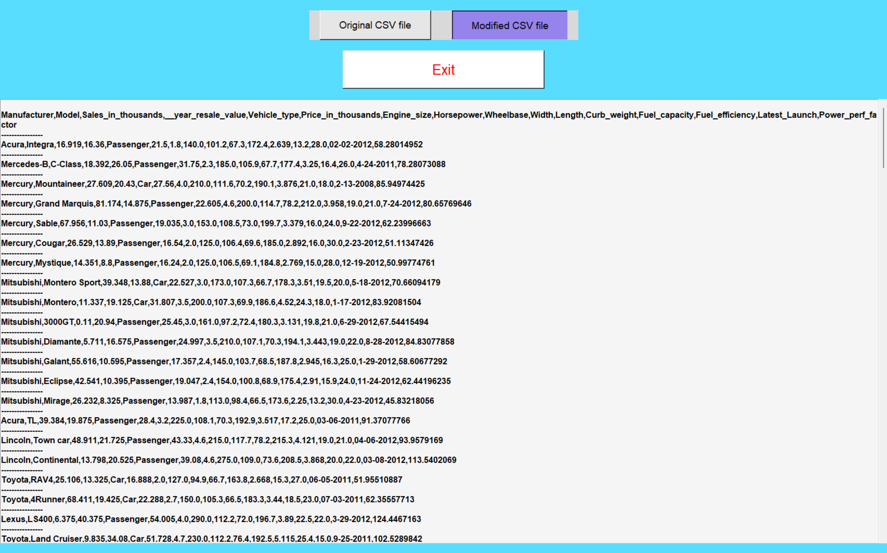
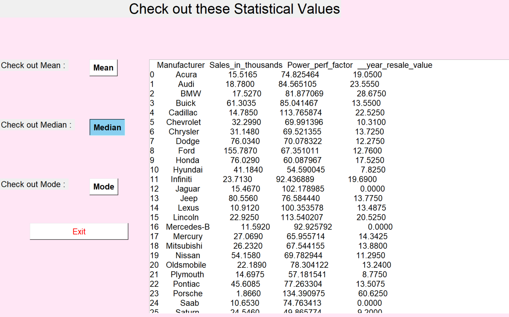
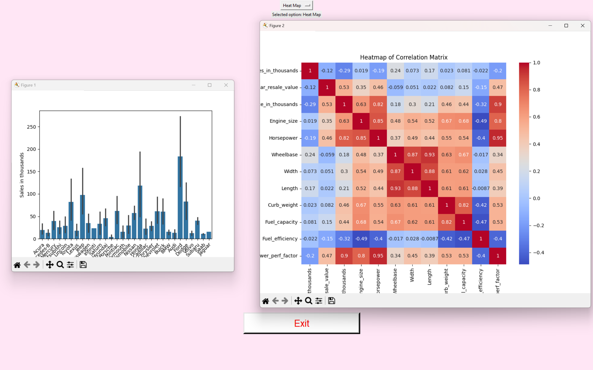
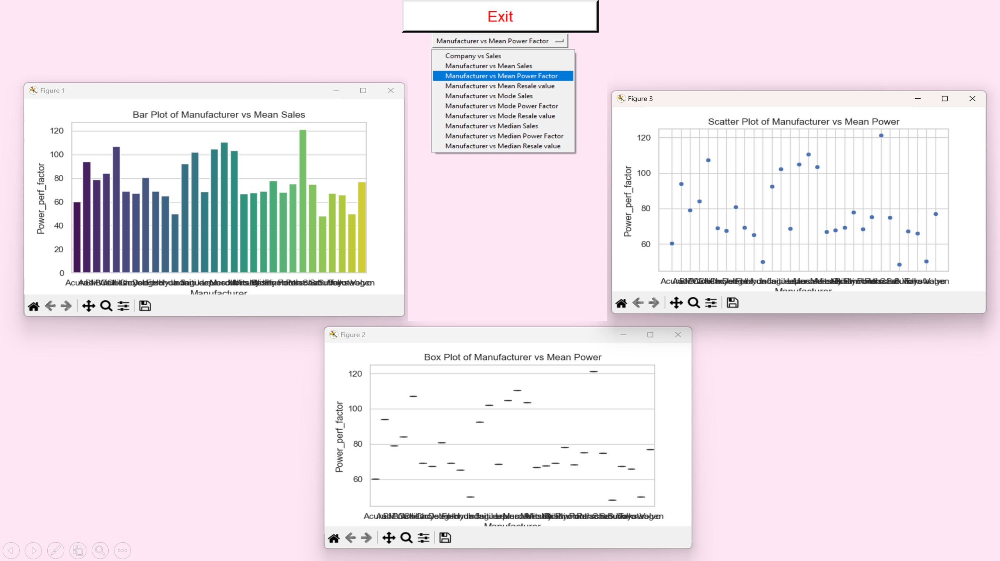

# 📊 **DataViz: GUI-Based Data Analysis and Visualization**

  
  
  

---

## 🖼️ **Project Demo**  
👉 Screenshots of the GUI application is provided below:  

- **Main Dashboard**  
    

- **Data Cleaning**  
   
   

- **Data Statistics**  
   

- **Data Analysis**  
    

- **Data Visualization**  
    

---

## 🌟 **Features**  
- 📂 **Data Import and Preprocessing**  
  - Supports importing any CSV file.  
  - Built-in tools for handling missing values and data cleaning.  

- 📈 **Interactive Visualizations**  
  - Generate bar charts, line graphs, scatter plots, and heatmaps.  
  - Customize visuals with themes and interactive sliders.  

- ⚙️ **Statistical Analysis**  
  - Summarize data with descriptive statistics.  
  - Perform correlation analysis and hypothesis testing.  

- 🖥️ **User-Friendly GUI**  
  - Intuitive interface for users.  
  - Simple GUI build using Tkinter.  

---
## 🛠️ **Built With**

- **Python**: Core programming language.
- **Pandas**: For data manipulation and analysis.
- **Matplotlib**: For basic visualizations.
- **Seaborn**: For advanced and aesthetic plots.
- **Tkinter**: GUI framework used to build the application interface.
---

## 🚀 **How to Run**  
1. **Clone the Repository**  
   ```bash
   git clone https://github.com/username/DataViz.git
   cd DataViz

---
2. **Install Dependencies**
    ```bash
    pip install -r requirements.txt
---
3. **Run the Application**
    ```bash
    python app.py
---
4. **Enjoy Analyzing Your Data Effortlessly! 🎉📊✨**
---
## 🤝 Contributing

- If you would like to contribute to this project, feel free to fork the repository, make changes, and submit a pull request. Contributions to improve data visualization, enhance performance, or add new features are welcome!
---
## 👨‍💻 About the Developer

- This project was developed by **Tharunkrishna M** as part of an effort to create a GUI-based Python application for data analysis and visualization using popular libraries such as **Pandas**, **Matplotlib**, and **Seaborn**
---
